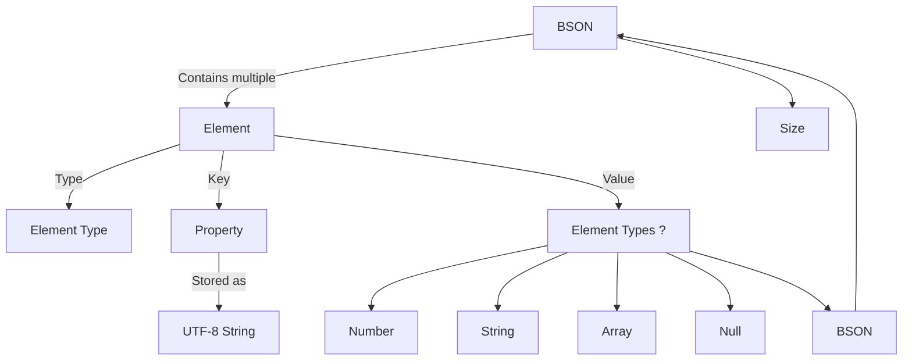

# Case Study: Recursive type definition with the bson format

[BSON](https://fr.wikipedia.org/wiki/BSON) is a binary
serialization format that can roughly be described as _'Binary JSON'_.
It integrates the same principle as JSON format allowing to defines recursive
object that can contains: arrays, numbers or string and extends some of those
data types as well.

## 🏗 Understanding the Structure

The following graph illustrates a simplified BSON definition:



The BSON definition consists of a series of _elements_ that each have an
associated _data type_, _property name_ and _data_.

## ♦ Step 1: A naive BSON definition

To make it easier this article will use a reduced number of data types. More
are defined in the code source available in the [example](https://github.com/tperale/binspector/blob/dev-example-bson/example/bson/bson.ts)
directory.

```typescript
class BsonString {
  @Int32
  size: number

  @Size('size - 1')
  @Utf8
  name: string

  @Match(0)
  @Uint8
  terminator: number
}

class Element {
    @Uint8
    type: number

    @Utf8
    @NullTerminated
    property: string

    @Choice('type', {
        0x00: undefined,
        0x01: PrimitiveSymbol.float64,
        0x02: BsonString,
        0x03: Bson,
        0x04: Bson,
    })
    data: number | BsonString | Bson
}

class BSON {
    @Uint32
    length: number

    @Size('length - 5') 
    @Relation(Element)
    elements: Element[]

    @Match(0)
    @Uint8
    terminator: number
}
```

Some thing we can already notice:

* The number of elements is based on the length defined in the first property.
  You have to substract to this length the size of the `length` property and
  the terminator (5 bytes). This can be done directly inside the `@Size`
  decorator (see ['Size' doc](/binspector/functions/Controller.Size.html)).
* `property` are utf-8 encoded and with the `@NullTerminated` decorator is can
  be read and write correctly (see ['NullTerminated' doc](/binspector/functions/Helper.NullTerminated.html)).
* The `@Choice` decorator is used to reference wich underlying relation to read
  for each element based on its type (see ['Choice' doc](/binspector/functions/Condition.Choice.html)).

### ❌The Issue

Trying to run this code we will encounter the following error:

```txt
Class 'Bson' used before its declaration.

Related information:

  * bson.ts#...,..: 'Bson' is declared here.

 (tsserver 2449)
```

This is the complexity of this format, arrays or recursive objects
definitions are tricky to express.
The moment the `Element` class will be read the `Bson` reference is
equals to `undefined`.
Once the `@Choice` decorator is executed the recursive definition will
reference `undefined`.

## ♦ Step 2: Using Lazy Evaluation

Instead of referencing Bson directly inside `@Choice`, define a lookup table
where values are functions that return types dynamically:

```typescript
const CHOICES = {
    0x00: () => undefined,
    0x01: () => PrimitiveSymbol.float64,
    0x02: () => BsonString,
    0x03: () => Bson,
    0x04: () => Bson,
}
```

This ensures Bson is only resolved when CHOICES is accessed, not when the class
is initially defined.

## ♦ Step 3: Use `@Select` instead of `@Choice`

Replace the `@Choice` decorator with the `@Select`. Both
are similar in practice but the `@Choice` one defines the conditions and
primitve statically while `@Select` get the primitive dynamically at runtime
(see ['Select' doc](/binspector/functions/Condition.Select.html)).

```typescript
class Element {
    @Uint8
    type: number

    @Utf8
    @NullTerminated
    property: string

    @Select(_ => CHOICES[_.type]())
    data: number | Protocol
}
```

Now, when `data` is read, the correct relation is selected at runtime, avoiding
the premature reference issue.

## 🎯 Final BSON Definition

With these fixes, we can now define a full BSON parser using Binspector:

```typescript
enum BSONType {
  EndOfObject = 0x00,
  NumberDouble = 0x01,
  String = 0x02,
  Object = 0x03,
  Array = 0x04,
  ...
}

export class BsonElement {
  @Enum(BSONType)
  @Uint8
  bson_type: keyof typeof BSONTypeMap

  @Utf8
  @NullTerminated
  name: string

  @Select(_ => ({
    [BSONType.EndOfObject]: () => undefined,
    [BSONType.NumberDouble]: () => PrimitiveSymbol.float64,
    [BSONType.String]: () => BsonString,
    [BSONType.Object]: () => Bson,
    [BSONType.Array]: () => Bson,
    ...
  }[_.bson_type]()))
  data: any
}

@LittleEndian
export class Bson {
  @Int32
  size: number

  @Size('size - 5')
  @Relation(BsonElement)
  fields: BsonElement

  @Match(0)
  @Uint8
  terminator: number
}
```

## 🔑 Key Takeaways

When working with recursive binary file format:

* Use _lazy evaluation_ to delay the subtype resolution at runtime.
* Use `@Select` instead of `@Choice` to ensure dynamic evalution.
