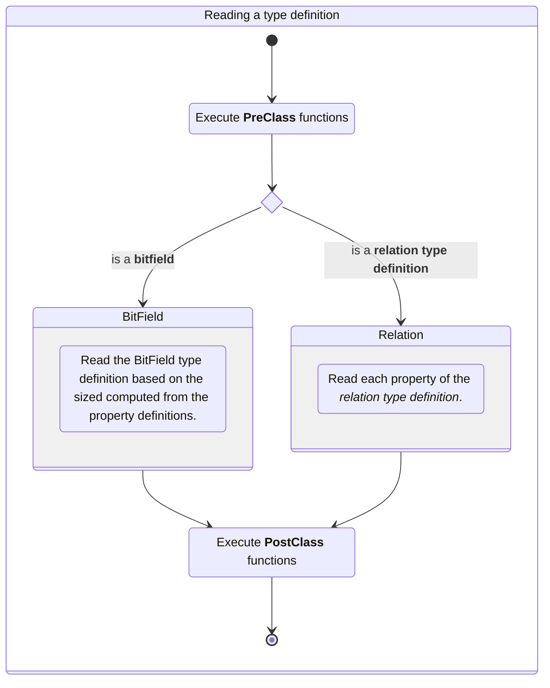
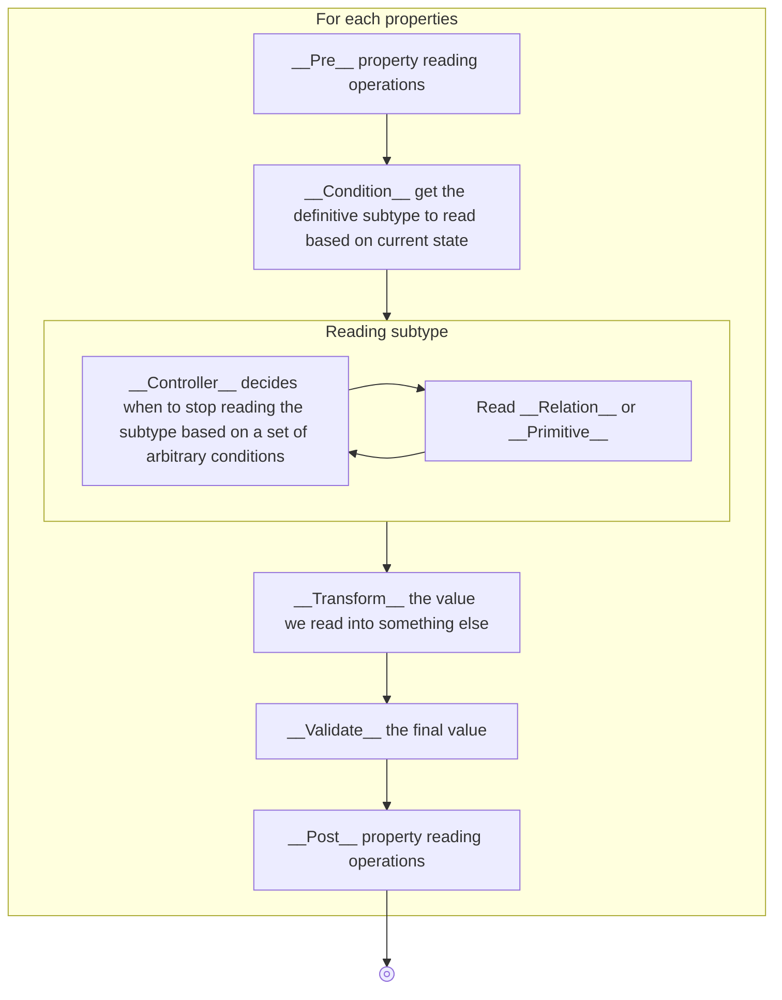
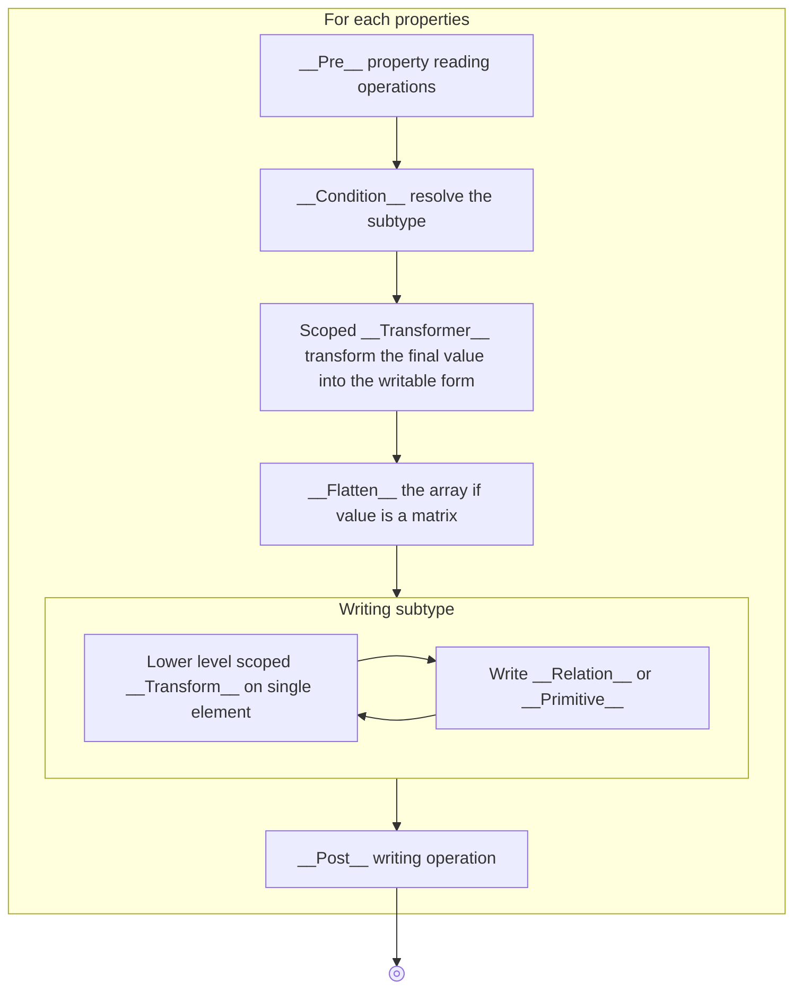

# 🚀 Getting Started with Binspector

__Binspector__ is a library to create _declarative_ binary file formats
_definitions_.
It provides the tools to encode and decode binary file based on these
definitions.

It takes heavy inspiration from _C structs_. which provides declarative,
simple and elegant way to describe a binary data structures.

```c
struct {
    uint8_t foo;
    uint16_t bar;
}
```

Since Typescript lacks built-in structures to describe integer length,
Binspector introduces _decorators_ used alongside class properties to
mimic that behaviour:

```typescript
class {
    @Uint8 foo
    @Uint16 bar
}
```

Using decorators to define binary structures offers several advantages:

* __Declarative & Readable__ – The binary format is described naturally
  alongside class properties. You define the binary format in the same
  place as the Typescript class.
* __No Duplicate Type Definitions__ – The binary definition doubles as
  the type definition, leveraging TypeScript's type system.
* __Seamless Integration__ – Methods that process binary data
  can be written alongside the format definition.

## ❓ Why a TypeScript library

Using JS or one of its dialect to perform lower level operation on binary files
may not be the most obvious choice.
Working with a language such as TypeScript makes it easy for the code to run on
webpages, and while a lot of tools are available online to modify or analyze
binary files they often threat the file in their backend.
Using a TypeScript library allows us to do all of this entirely in the frontend
making you able to provide webapp that threat binary data running on Github
Pages.

Other library exists for binary parsing in TS, but Binspector prioritzes 
declarative a declarative syntax and serialization support.

## ⚙️ How does it works

Each decorator you use on top of a property or class will store
[metadata](https://www.typescriptlang.org/docs/handbook/release-notes/typescript-5-2.html#decorator-metadata)
providing information on how read and write the binary file definition.

### 📂 Categories of Decorators

The decorators are sorted into different categories:


| Category        | Description                                                                             |
|-----------------|-----------------------------------------------------------------------------------------|
| **Primitive**   | Defines basic types (`Uint8`, `Uint16`, etc.) and references to other structured types. |
| **Bitfield**    | Defines bitwise structures.                                                             |
| **Condition**   | Defines conditional reading rules.                                                      |
| **Controller**  | Controls how a property is read (loops, etc...).                                        |
| **Transformer** | Transforms values after reading or before writing (encoding, etc... ).                  |
| **Validator**   | Ensures correctness (e.g., validating magic numbers).                                   |
| **PrePost**     | Executes pre/post operations (e.g., jumping offsets, aligning data).                    |
| **Context**     | Stores shared values during read/write operations.                                      |
| **Helper**      | Bundles multiple categories into a single, easy-to-use decorator.                       |

### 🔍 The binary definition reading

Let's define a simple definition with Binspector.

```typescript
class Protocol {
    @Uint8 foo;
    @Uint16 bar;
}
```

To parse the content of a file formatted as the `Protocol` definition you will
use the following code.

```typescript
import { BinaryReader, binread } from 'binspector'
import * as fs from 'node:fs'
import * as path from 'node:path'

const data = fs.readFileSync(path.join(import.meta.dirname, 'file.bin'))
const protocol = binread(new BinaryReader(data), Protocol)
```

From an high level point of view the `binread` function will first check
whether the structure is a bitfield or a _relation type definition_.



As described above _relation type definition_ can take advantage of a lot of
decorators categories to describe how each property of your definition is read.
The `binread` function will threat those categories sequentially:



### ✍ The binary definition writing

The following code snippets shows how to serialize an object into a binary
buffer based on a Binspector definition. That buffer is then saved into a file.

```typescript
import { BinaryWriter, binwrite } from 'binspector'
import { promises as fs } from 'fs'
import path from 'path'

const obj = {
    foo: 0x00,
    bar: 0x01
}

const protocol = binwrite(new BinaryWriter(), obj, Protocol)

const buf = protocol.buffer() // <= ArrayBuffer(...)

await fs.appendFile(path.join(__dirname, 'proto.bin'), new Uint8Array(buf));
```

From an high level point of view the writing procedure almost reverse the steps
done during the reading phase.


