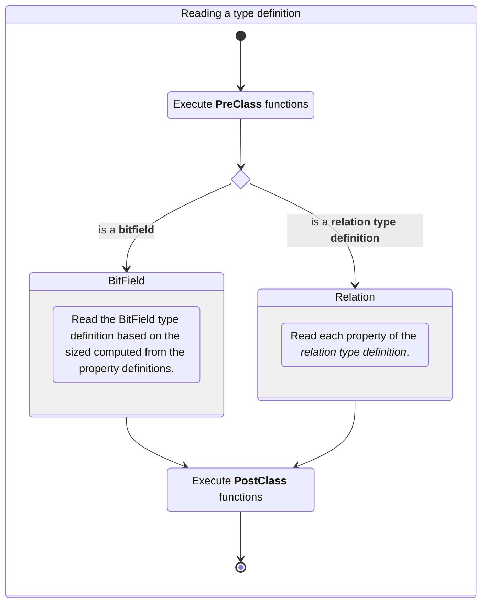
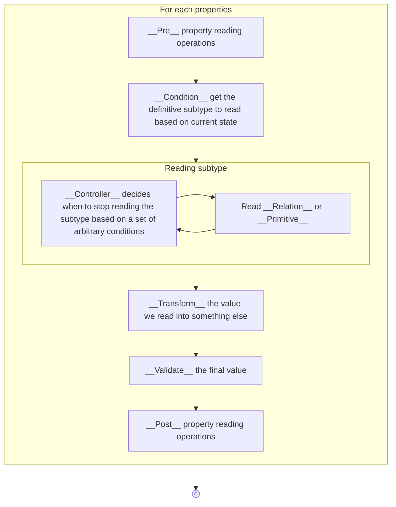
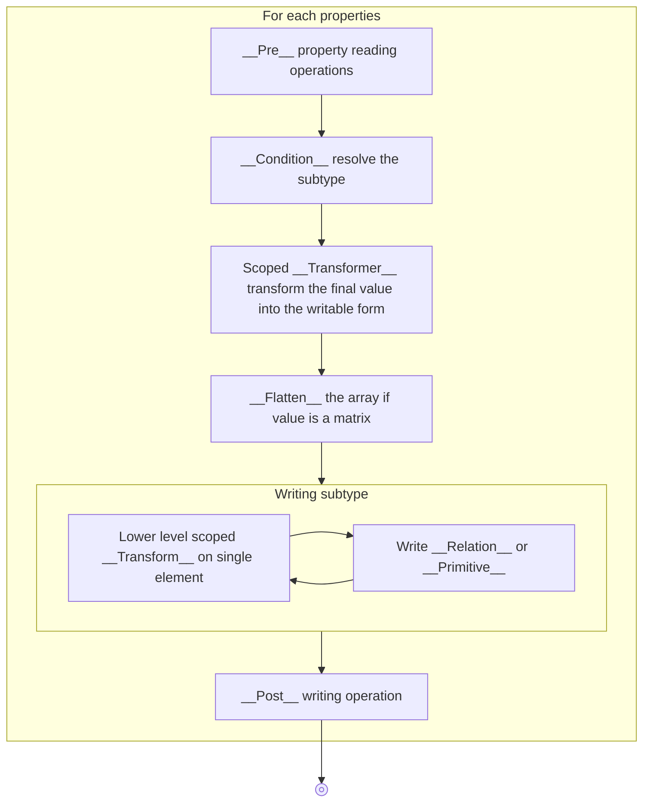

# Getting Started with Binspector

__Binspector__ is a TypeScript library for describing, reading, and writing
binary file formats using _declarative_ class definitions.
It provides the tools to encode and decode binary file based on these
definitions.

It takes inspiration from _C structs_, which provide a declarative, simple and
elegant way to describe binary data structures.

```c
struct {
    uint8_t foo;
    uint16_t bar;
}
```

Typescript lacks built-in structures to describe integer size,
Binspector defines a set of decorators used alongside class properties to mimic
that behaviour:

```typescript
class {
    @Uint8
    foo: number

    @Uint16
    bar: number
}
```

Using decorators to define binary structures offers several advantages:

* __Declarative & Readable__ – The binary format is described naturally
  alongside class properties. You define the binary format in the same
  place as the Typescript class.
* __No Duplicate Type Definitions__ – The binary definition doubles as
  the type definition, leveraging TypeScript's type system.
* __Seamless Integration__ – Methods that process binary data
  can be written alongside the format definition.

## Motivation behind this library

Working with binary formats is often associated with low-level languages such
as C or Rust. TypeScript are rarely considered for such tasks. However, it is
the goto language of the web with a rich ecosystems for building graphical
interfaces and web pages.

This makes TypeScript a strong candidate for building __browser-based tools__
that inspect, visualize, or modify binary formats.

For example, a web application built with Binspector can read and modify binary
files directly in the browser. The entire operation happens on the client side,
without uploading the file to a server. This makes it possible to build static
web tools that run anywhere, including platforms like GitHub Pages.

While other libraries exists for binary parsing in TS, Binspector prioritizes
declarative syntax, along with built-in support for parsing and serialization.

## How it works

Each decorator you use on top of a property or class will store
[metadata](https://www.typescriptlang.org/docs/handbook/release-notes/typescript-5-2.html#decorator-metadata)
with information on how to read and write a binary blob associated to the
definition.

### Categories of Decorators

The __Binspector__ library provides a variety of decorators used to describe
the control flow for reading & writing binary blobs.
They are grouped into different categories used to divide their
responsabilities:

| Category        | Description                                                                             |
|-----------------|-----------------------------------------------------------------------------------------|
| **Primitive**   | Defines basic types (`Uint8`, `Uint16`, etc.) and references to other structured types. |
| **Bitfield**    | Defines bitwise structures.                                                             |
| **Condition**   | Defines conditional reading rules.                                                      |
| **Controller**  | Controls how a property is read (loops, etc...).                                        |
| **Transformer** | Transforms values after reading or before writing (encoding, etc... ).                  |
| **Validator**   | Ensures correctness (e.g., validating magic numbers).                                   |
| **PrePost**     | Executes pre/post operations (e.g., jumping offsets, aligning data).                    |
| **Context**     | Stores shared values during read/write operations.                                      |
| **Helper**      | Bundles multiple categories into a single, easy-to-use decorator.                       |

### The binary definition reading

Let's define a simple definition with Binspector.

```typescript
class Protocol {
    @Uint8 foo;
    @Uint16 bar;
}
```

To parse the content of a file formatted as the `Protocol` definition you will
use the following code.

```typescript
import { BinaryReader, binread } from 'binspector'
import * as fs from 'node:fs'
import * as path from 'node:path'

const data = fs.readFileSync(path.join(import.meta.dirname, 'file.bin'))
const protocol = binread(data, Protocol)
```

At a high level point of view the `binread` function will first check
whether the structure is a bitfield or a _relation type definition_.


```mermaid
stateDiagram-v2
state if_state <<choice>>
start: Reading a type definition
state start {
    PreClass: Execute __PreClass__ functions
    [*] --> PreClass
    PreClass --> if_state
    if_state --> BitField: is a __bitfield__
    if_state --> Relation : is a __relation type definition__
    state Relation {
        ReadRel: Read each property of the _relation type definition_.
    }
    state BitField {
        ReadBF: Read the BitField type definition based on the sized computed from the property definitions.
    }
    BitField --> PostClass
    Relation --> PostClass
    PostClass: Execute __PostClass__ functions
    PostClass --> [*]
}
```

As described above _relation type definition_ can take advantage of a lot of
decorators categories to describe how each property of your definition is
read.
The `binread` function processes each category sequentially:


```mermaid
flowchart TB
 subgraph s1[For each properties]
 direction TB
 PreOperation[__Pre__ property reading operations] --> Condition
 click PreOperation "/binspector/modules/PrePost.html" "Documentation for 'Pre' type decorators"
 Condition[__Condition__ get the definitive subtype to read based on current state] --> s2
 click Condition "/binspector/modules/Condition.html" "Documentation for 'Condition' type decorators"
 subgraph s2[Reading subtype]
 Controller[__Controller__ decides when to stop reading the subtype based on a set of arbitrary conditions] --> TypeReading[Read __Relation__ or __Primitive__]
 click Controller "/binspector/modules/Controller.html" "Documentation for 'Controller' type decorators"
 click TypeReading "/binspector/modules/Primitive.html" "Documentation for 'Primitive' type decorators"
 end
 TypeReading --> Controller
 s2 --> Transform[__Transform__ the value we read into something else]
 click Transform "/binspector/modules/Transformer.html" "Documentation for 'Transformer' type decorators"
 Transform --> Validate[__Validate__ the final value]
 click Validate "/binspector/modules/Validator.html" "Documentation for 'Validator' type decorators"
 Validate --> PostOperation[__Post__ property reading operations]
 click PostOperation "/binspector/modules/PrePost.html" "Documentation for 'Post' type decorators"
 end
 PostOperation -->  A@{ shape: framed-circle, label: "Stop" }
```

### The binary definition writing

The following code snippets shows how to serialize an object into a binary
buffer based on a Binspector definition. That buffer is then saved into a file.

```typescript
import { BinaryWriter, binwrite } from 'binspector'
import { promises as fs } from 'fs'
import path from 'path'

const obj = {
    foo: 0x00,
    bar: 0x01
}

const protocol = binwrite(obj, Protocol)

const buf = protocol.buffer // <= ArrayBuffer(...)

await fs.appendFile(path.join(__dirname, 'proto.bin'), new Uint8Array(buf));
```

From an high level point of view the writing procedure almost reverse the steps
done during the reading phase.


```mermaid
flowchart TB
 subgraph s1[For each properties]
 direction TB
 PreOperation[__Pre__ property reading operations] --> Condition
 click PreOperation "/binspector/modules/PrePost.html" "Documentation for 'Pre' type decorators"
 Condition[__Condition__ resolve the subtype] --> Transform
 click Condition "/binspector/modules/Condition.html" "Documentation for 'Condtion' type decorators"
 Transform[Scoped __Transformer__ transform the final value into the writable form] --> Flatten
 click Transform "/binspector/modules/Transformer.html" "Documentation for 'Transformer' type decorators"
 Flatten[__Flatten__ the array if value is a matrix]-->  s2
 subgraph s2[Writing subtype]
 Transform2[Lower level scoped __Transform__ on single element] --> TypeWrite[Write __Relation__ or __Primitive__]
 click TypeWrite "/binspector/modules/Primitive.html" "Documentation for 'Primitive' type decorators"
 TypeWrite --> Transform2
 end
 s2 --> PostOperation[__Post__ writing operation]
 click PostOperation "/binspector/modules/PrePost.html" "Documentation for 'Post' type decorators"
 end
 PostOperation -->  A@{ shape: framed-circle, label: "Stop" }
```
