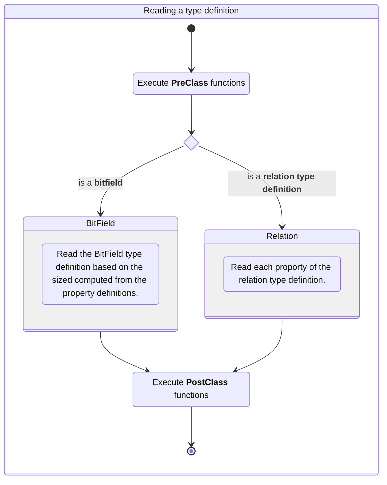
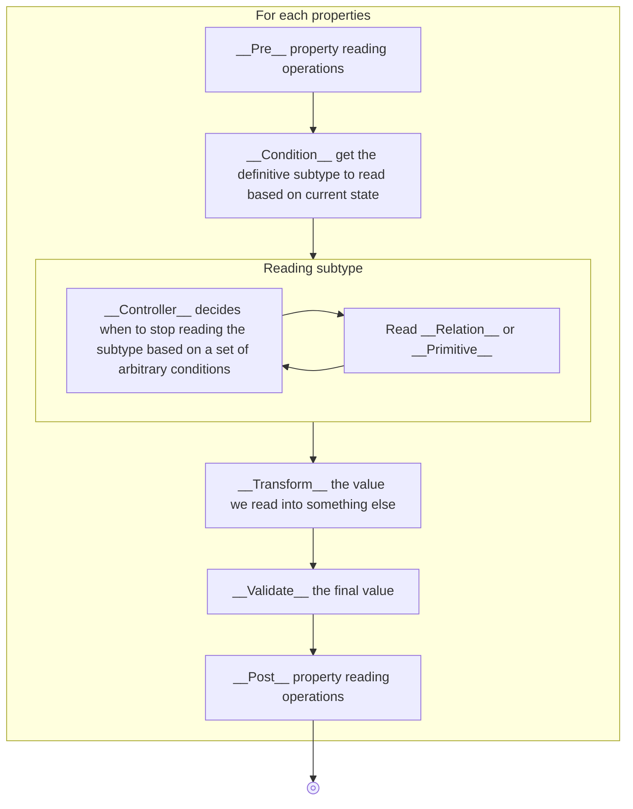

# Getting Started with Binspector

The idea behind _binspector_ is to create declarative binary file format definition
library and provide tool to encode/decode binary file based on those definition. 

It takes heavy inspiration from C structure that are declarative, simple and
elegant way to describe a binary buffer.

```c
struct {
    uint8_t foo;
    uint16_t bar;
}
```

Since Typescript lacks such internal structure that can provide that amount of
detail the use of _decorator_ on top of class properties were chosen instead to
mimic that behaviour.

The benefit of reallying on decorators that describe the properties of a TS class
is that you don't have to write to type definition twice but can directly write
the methods that will handle the content of your file format in the same place
as where it's being declared.

## The binary definition reading

Each decorator you use on top of property will store metadata on how to parse
a binary file being read based on the binary file definition it made.

```typescript
import { BinaryReader, binread } 
import { promises as fs } from 'fs'
import path from 'path'

const data = await fs.readFile(path.join(__dirname, 'file.bin'))
const protocol = binread(new BinaryReader(data.buffer), ProtocolDefinition)
```

From an high level point of view the binary reader will start by reading
the `ProtocolDefinition` passed as an argument of `binread`.



__Relation type definition__ have a lot of helper decorators to helps you
describing each property of your file definition as declaratively as possible.
The decorators are devided into differents section and executed by the reading
loop at different moments.


